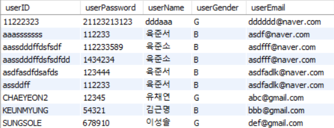

# Bakery Web Site

메인화면, 물건 구매, 회원가입, 로그인, 로그아웃, 세션 기능, 게시판 글쓰기 등 간단하게 구현하여 웹공부를 진행하였습니다.

링크 : [http://cy990426.cafe24.com/](http://cy990426.cafe24.com/)

배포 일시 : 2021.06.07 - 202107.10.03

## Bakery Web Site의 기능

### 데이터베이스 사용

웹사이트에 필요한 데이터를 저장하기 위해 데이터베이스 관리 시스템인 MySQL을 사용하였고, 기능 구현을 위해 데이터베이스에 사용자의 정보를 저장하기 위한 USER TABLE과 게시판의 글을 저장하기 위한 BBS TABLE을 생성했고, 데이터를 담아서 읽어오거나 보내는 껍데기와 같은 역할을 하는 JavaBeans, JDBC를 이용해 자바와 DBMS 사이를 연결하여 명령어를 수행해주는 DAO를 만들어 데이터베이스를 사용했습니다.

- TABLE : USER TABLE, BBS TABLE
- JavaBeans : User.jave, Bbs.java
- DAO : UserDAO.jave, BbsDAO.java

USER TABLE

BBS TABLE

User JavaBeasn(User.java)

BBS JavaBeans(Bbs.java)

UserDAO.java

- UserDAO() : 생성자, 데이터베이스와 연결을 시도하는 부분
- login(String userID, String userPassword) : 로그인을 위한 부분, select 문 이용하여 데이터베이스의 정보와 일치하면 로그인, 아니면 로그인 실패
- join(User user) : 회원가입을 위한 부분, insert문 이용하여 데이터 삽입.

BbsDAO.java

- BbsDAO() : 생성자, 데이터베이스와 연결을 시도한다.
- getData() : 현재의 날짜를 반환한다.
- getNext() : 게시물의 고유번호를 측정한다.
- write(String bbsTitle, String userID, String bbsContent) : 게시글을 작성한다.
- getList(int pageNumber) : 글의 목록을 만들기 위한 부분이다. 10개 까지만 보인다.
- nextPage(int pageNumber) : 페이징 처리를 위해 특정 페이지 존재 여부 판단.
- getBbs(int bbsID) : 글의 정보를 얻어 뿌려준다.
- update(int bbsID, String bbsTitle, String bbsContent) : 글을 수정한다.
- delete(int bbsID) : 글을 삭제한다.

### 메인화면

Templated라는 사이트에서 제공되는 템플릿 중 하나에 대해 소스코드 분석을 하며 HTML, CSS 등의 파일을 새로 만들어보았습니다.  원래의 코드는 사진 웹 사이트였기 때문에 기존의 코드를 다시 작성하고 코드를 필요에 맞게 변경하여 Bakery Web Site에 맞도록 Customizing하였고, 다른 

아래의 제과들은 display 속성을 flex로 정렬하여 사진의 크기 만큼만 자리를 차지하도록 정렬하였습니다.

**Flex** 

이외의 다른 화면들은 직접 코드를 작성해 개발하였고, fontello와 google-font를 사용하여 폰트와 아이콘을 디자인적으로 보기 좋게 꾸몄습니다.

기존의 Block 속성 적용

Flex 속성 적용

## 회원가입 화면

회원가입 시 사용자의 아이디, 비밀번호, 이름, 성별, E-Mail 정보를 입력받아 데이터베이스로 보냅니다.

## 로그인 화면

아이디와 비밀번호를 입력한 뒤 login버튼을 클릭하면 데이터베이스의 정보와 비교한 뒤 정보가 일치하면 로그인 이후의 화면(index_loginOk.html)으로 화면을 전환하여 로그인 기능을 구현하였습니다.

## 물건 구매

배송을 원하는 날짜를 입력하면 주문할 수 있도록 구현하였습니다.

## 게시판

데이터베이스에 있는 글 중 10개만 출력되게 하였고, 10개가 넘어가면 다음 버튼을 통해 넘어가도록 구현하였습니다.

**글쓰기**

글쓰기를 클릭하면 글쓰기로 넘어가고 내용을 입력해 글쓰기를 다시 클릭하면 사용자가 작성한 내용이 데이터베이스에 포함되면서 게시판 화면이 갱신되게 구현하였습니다.

**글수정**

session을 설정하여 본인의 글일 경우 수정/삭제가 가능하며, 본인의 글이 아닐 경우 수정이나 삭제 버튼이 없게 구현하였습니다.

수정할 경우 글을 수정하여 수정 완료 버튼을 누르면 글이 수정된 것을 확인할 수 있습니다.

**삭제**

삭제 버튼을 누르면 alert창이 뜨고 확인을 누르면 글이 데이터베이스에서 삭제 되어 화면이 갱신됩니다.

참고 : templated.co